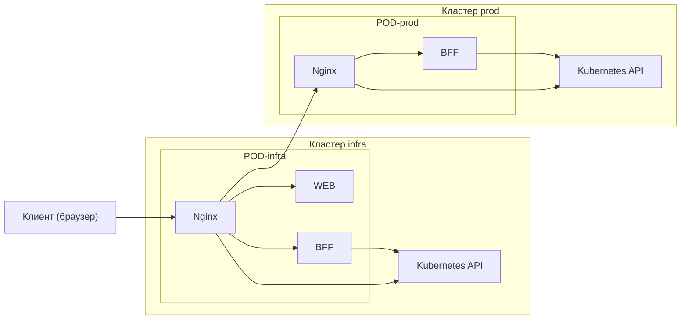

import { FancyboxDiagram } from '@site/src/components/commonBlocks/FancyboxDiagram'

# Компоненты

## Архитектура
> Ниже приведена архитектура решения, с точки зрения набора компонентов и их логической коммутации.

  <FancyboxDiagram>

  </FancyboxDiagram>

## Описание компонентов

- **Клиент (браузер)**: пользовательский интерфейс для взаимодействия с системой.
- **Nginx**: L7‑прокси, управляющий маршрутизацией входящих запросов.
- **WEB**: визуальный модуль для отображения данных и построения интерфейса.
- **BFF**: промежуточный слой агрегации и оптимизации запросов от клиента.
- **Kubernetes API**: интерфейс доступа к управляемому окружению.
