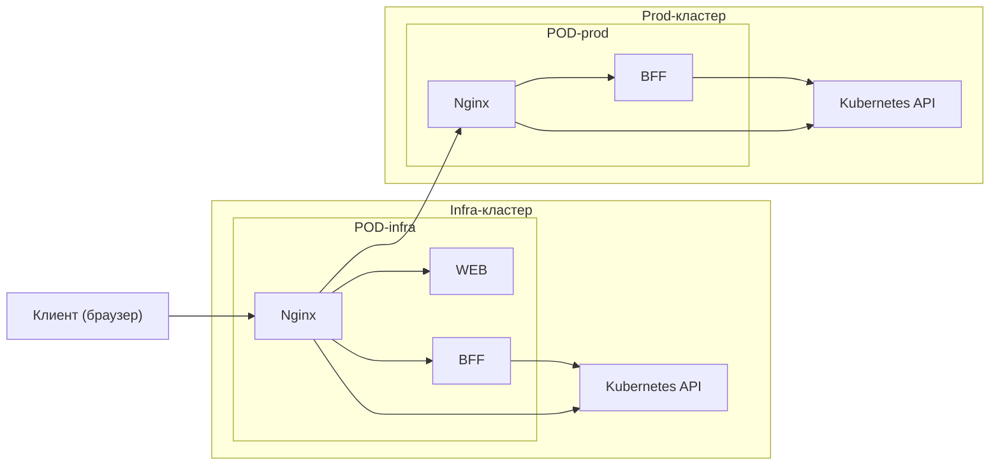

import { FancyboxDiagram } from '@site/src/components/commonBlocks/FancyboxDiagram'

# Компоненты

---
## Архитектура
> Ниже представлена архитектура решения с точки зрения набора компонентов и их логической связности.

  <FancyboxDiagram>

```mermaid
flowchart LR

  browser["Клиент (браузер)"]

  subgraph "Infra-кластер"
    direction LR
    subgraph "POD-infra"
      direction LR
      nginx1["Nginx"]
      web["WEB"]
      bff1["BFF"]
    end
    k8s1["Kubernetes API"]

    bff1-->k8s1

    nginx1-->web
    nginx1-->bff1
    nginx1-->k8s1
  end

  subgraph "Prod-кластер"
    direction LR
    subgraph "POD-prod"
      direction LR
      nginx2["Nginx"]
      bff2["BFF"]
    end
    nginx2["Nginx"]
    bff2["BFF"]
    k8s2["Kubernetes API"]

    bff2-->k8s2

    nginx2-->bff2
    nginx2-->k8s2
  end

  browser-->nginx1
  nginx1-->nginx2
```

  </FancyboxDiagram>

---
## Описание компонентов

- **Клиент (браузер)**: пользовательский интерфейс для взаимодействия с системой.
- **Nginx**: L7-прокси, управляющий маршрутизацией входящих запросов.
- **WEB**: визуальный модуль, отвечающий за отрисовку данных и построение интерфейса.
- **BFF**: промежуточный слой для агрегации и оптимизации запросов от клиента.
- **Kubernetes API**: интерфейс доступа к управляемой среде.
