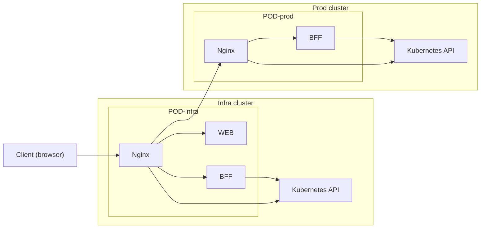

import { FancyboxDiagram } from '@site/src/components/commonBlocks/FancyboxDiagram'

# Components

---
## Architecture
> Below is the solution architecture from the perspective of its component set and logical connectivity.

  <FancyboxDiagram>

```mermaid
flowchart LR

  browser["Client (browser)"]

  subgraph "Infra cluster"
    direction LR
    subgraph "POD-infra"
      direction LR
      nginx1["Nginx"]
      web["WEB"]
      bff1["BFF"]
    end
    k8s1["Kubernetes API"]

    bff1-->k8s1

    nginx1-->web
    nginx1-->bff1
    nginx1-->k8s1
  end

  subgraph "Prod cluster"
    direction LR
    subgraph "POD-prod"
      direction LR
      nginx2["Nginx"]
      bff2["BFF"]
    end
    nginx2["Nginx"]
    bff2["BFF"]
    k8s2["Kubernetes API"]

    bff2-->k8s2

    nginx2-->bff2
    nginx2-->k8s2
  end

  browser-->nginx1
  nginx1-->nginx2
```

  </FancyboxDiagram>

---
## Component Description

- **Client (browser)**: the user interface for interacting with the system.
- **Nginx**: an L7 proxy that manages incoming request routing.
- **WEB**: the visual module responsible for rendering data and building the interface.
- **BFF**: an intermediate layer for aggregating and optimizing requests from the client.
- **Kubernetes API**: the access interface to the managed environment.
